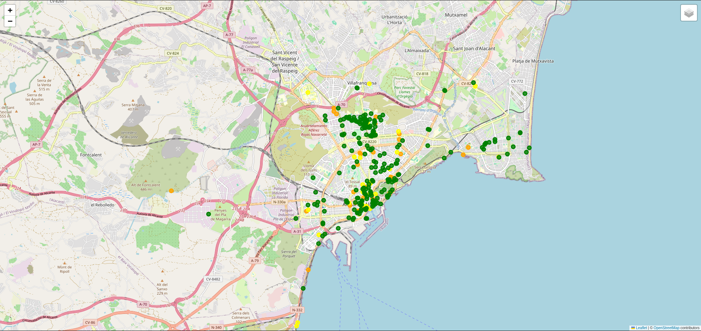
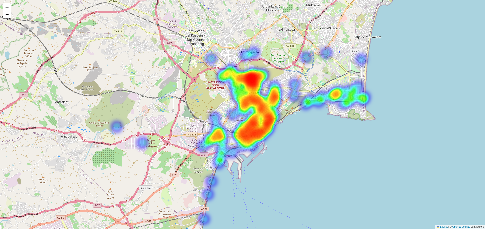
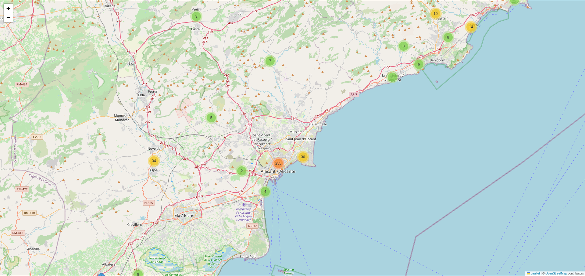

# La Accesibilidad en Alicante  
**Adquisición y Preparación de Datos**  
**Ingeniería en Inteligencia Artificial - UA**

---

## Integrantes
- Ignacio Mendoza Díaz  
- Carlos Vidal Rodríguez  
- Santiago Álvarez Geanta  

---

## Descripción del proyecto
Nuestro proyecto se centra en la **accesibilidad urbana en Alicante**, orientado a personas con movilidad reducida, especialmente usuarios de sillas de ruedas. El objetivo es **centralizar, analizar y visualizar información sobre lugares accesibles**, facilitando la planificación de rutas y actividades con autonomía y seguridad.

---

## Objetivos
1. **Identificar lugares accesibles** mediante recopilación de datos de edificios y espacios públicos.  
2. **Clasificar zonas urbanas** según su accesibilidad: alta, media, baja o muy baja.  
3. **Visualizar ubicaciones** para planificar recorridos de manera eficiente.

---

## Fuentes de datos
- **Portal de Datos Abiertos de la Generalitat Valenciana** (edificios públicos).  
- **OpenStreetMap** (comercios y espacios cotidianos).  
- **API Nominatim** para geocodificación y contexto geográfico.  

Excluimos el transporte público, debido a su alta accesibilidad normativa, y nos centramos exclusivamente en la movilidad en sillas de ruedas.

---

## Almacén de datos
- **Modelo conceptual:** esquema en estrella con el hecho principal `Accesibilidad` y dimensiones `Lugar`, `Municipio` y `Fecha`.  
- **Modelo lógico:** tabla de hechos `Accesibilidad(H)` y tabla de dimensión `Lugar(D)` con coordenadas geográficas y atributos descriptivos.  
- **Implementación física:** MySQL con índices para optimizar consultas y garantizar integridad referencial.

---

## Procesamiento de datos
1. **Limpieza y estandarización** con Pentaho Data Integration.  
2. **Feature Engineering y enriquecimiento** en Python:  
   - Eliminación de duplicados.  
   - Transformación de coordenadas EPSG:25830 a WGS84.  
   - Codificación de accesibilidad en escala 1-4.  
   - Geocodificación inversa para barrio, ciudad y tipo de lugar.  
3. **Fusión final** en un dataset normalizado listo para análisis y visualización.  

---

## Grafo de conocimiento
- Formato **RDF**, vocabulario **Schema.org**, enlazado con **Wikidata**.  
- Cada lugar se representa como `schema:Place`, con propiedades de ubicación y accesibilidad.  
- Resultado: 2,467 tripletas que permiten consultas semánticas y análisis Linked Data.

---

## Visualizaciones
Implementadas con **Python y Folium**:

### Mapa por niveles de accesibilidad
Colores según nivel de accesibilidad (0-4). Permite activar/desactivar los niveles para mejorar la visualización.

### Mapa de calor
Representa densidad la de lugares accesibles, destacando áreas con mayor cobertura.

### Mapa por clusters
Agrupa los puntos cercanos según nivel de zoom. Cada marcador incluye nombre y nivel de accesibilidad.

---

## Conclusión
Nuestro proyecto proporciona una **herramienta práctica y confiable** para visualizar y analizar la accesibilidad urbana en Alicante, mejorando la autonomía de personas con movilidad reducida y aportando información útil para planificación inclusiva.

## Referencias
- Documentación de Schema.org
- Wikidata
- Librería rdflib (Python)
- Folium
- Accesibilidad en edificios públicos en la Comunidad Valenciana
- Overpass